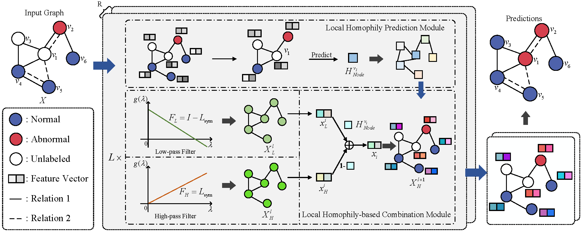

# Graph Local Homophily Network for Anomaly Detection
Official Implementation for the Graph Local Homophily Network for Anomaly Detection.



## Dependencies
This project is tested on cuda 11.7 with several dependencies listed below:
```
pytorch=2.0.0
torch-geometric=2.3.1
dgl=1.1.2
```

## How to run
### Datasets
YelpChi and Amazon can be downloaded from [CARE-GNN](https://github.com/YingtongDou/CARE-GNN/tree/master/data) or dgl.data.FraudDataset.
T-Finance and T-Social datasets developed in [BWGNN](https://github.com/squareRoot3/Rethinking-Anomaly-Detection).
Download and unzip all files in the `datasets` folder.


### Get start
Train GLHAD on YelpChi:
```
python train.py --wandb_mode disabled --dataset yelp --homo 0 \
--lr 0.005 --wd 0.001 --K 1 --hidden_channels 64 --dropout 0.1 --num_epochs 200  --gpu 0  --parameter_matrix 1 --multi_layer_concate 1 --filter_type dis --self_loop 1
```
See ```run.sh``` for more details.

## Attribution

Parts of the code are based on
- [LSGNN](https://github.com/draym28/LSGNN)
- [BWGNN](https://github.com/squareRoot3/Rethinking-Anomaly-Detection)
